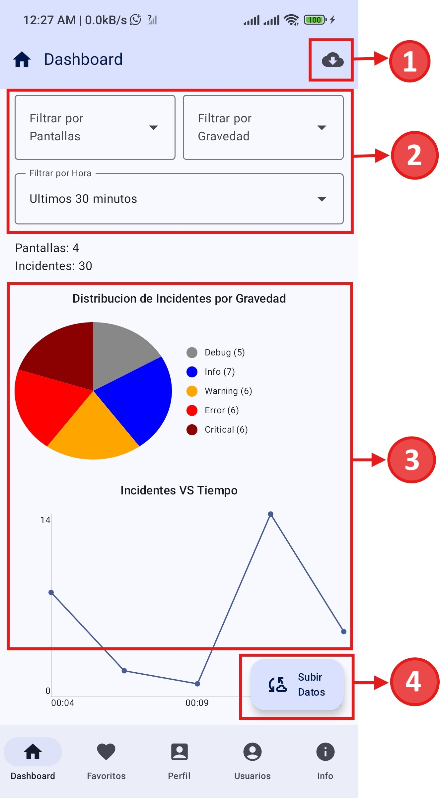
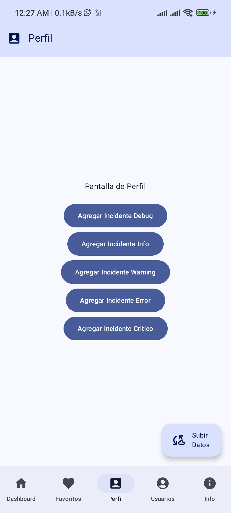

# Observability App - SDK Consumer

Este proyecto es una aplicación de Android que sirve como **capa de presentación y entorno de pruebas** para un SDK de observabilidad. La aplicación está construida con Jetpack Compose y Kotlin, y su propósito principal es demostrar y validar las funcionalidades del SDK. Esta aplicación de demostración está completamente configurada y lista para ser compilada. Puede ser instalada directamente en un dispositivo o emulador para comenzar a probar las funcionalidades del SDK de manera inmediata.

## Capturas de Pantalla

|             Pantalla Principal (Dashboard)              |    Pantalla de Generación de Incidentes     |
|:-------------------------------------------------------:|:-------------------------------------------:|
|  |  |

## El SDK de Observabilidad

El núcleo de la funcionalidad no reside en esta aplicación, sino en un conjunto de artefactos que componen el SDK. Esta aplicación es simplemente un **consumidor** de dicho SDK.

El SDK está dividido en tres módulos principales, cuyos artefactos ya se encuentran en el directorio `app/libs/`:

-   `domain-dev.aar`: Contiene los modelos de datos puros y definiciones.
-   `data-dev.aar`: Implementa los repositorios, fuentes de datos (Room) y la lógica de red (Ktor).
-   `presentation-dev.aar`: Contiene la lógica de presentación a través de `ContractObservabilityApi`, que es la interfaz pública del SDK para la UI.

**Nota Importante**: Los artefactos del SDK en este proyecto están configurados para apuntar a un backend en la dirección IP `192.168.1.3`. Debido a esto, se requiere recompilar nuevos artefactos como lo indica el README del proyecto ObservabilitySDK.

## 1. Integración del SDK en la App Consumidora

Los artefactos del SDK ya están incluidos en el proyecto. Así es como están integrados en el archivo `app/build.gradle.kts`:

```kotlin
// app/build.gradle.kts

dependencies {
    // ... otras dependencias

    // Artefactos del SDK
    implementation(files("libs/domain-dev.jar"))
    implementation(files("libs/data-dev.aar"))
    implementation(files("libs/presentation-dev.aar"))
}
```

## 2. Inicialización del SDK

La inicialización del SDK se realiza mediante Koin en la clase `MainApplication`. Esta clase se encarga de configurar la inyección de dependencias, cargando los módulos que cada artefacto del SDK expone.

```kotlin
// MainApplication.kt

class MainApplication : Application() {
    override fun onCreate() {
        super.onCreate()
        startKoin {
            androidContext(this@MainApplication)
            // Carga el módulo de la app y los módulos expuestos por el SDK
            modules(appModule, dataModule, presentationModule)
        }
    }
}
```

### Configuración del Manifiesto

Para que la inicialización funcione y la aplicación pueda comunicarse con el backend local, el `AndroidManifest.xml` debe incluir dos puntos clave:

1.  **Declarar la clase `Application`**: El atributo `android:name` en la etiqueta `<application>` debe apuntar a `.MainApplication` para asegurar que Koin se inicie al arrancar la app.

2.  **Permitir tráfico a direcciones IP locales**: El atributo `android:usesCleartextTraffic="true"` es **obligatorio**. Sin él, Android bloqueará por defecto las peticiones a `http://192.168.1.3`, impidiendo que el SDK se sincronice con el backend.

```xml
<!-- app/src/main/AndroidManifest.xml -->
<application
    android:name=".MainApplication"
    android:usesCleartextTraffic="true"
    ... >
    <!-- ... -->
</application>
```

## 3. Consumo de `ContractObservabilityApi` en la UI

`ContractObservabilityApi` es la interfaz que el SDK expone para que la UI interactúe con él. Se inyecta directamente en los Composables usando `koinInject()`.

-   **Estado (`state`)**: El SDK expone un `StateFlow` que contiene el estado de la UI (`state.isLoading`, `state.incidentsQuantity`, etc.).
-   **Eventos (`onEvent`)**: La UI notifica al SDK sobre acciones del usuario a través de la función `onEvent`, enviando acciones predefinidas como `MainActions.SyncToRemote`.

```kotlin
@Composable
fun ObservabilityApp(api: ContractObservabilityApi = koinInject()) {
  val state by api.state.collectAsStateWithLifecycle()
  val onEvent = api::onEvent

  // La UI utiliza el 'state' del SDK para mostrar datos y 'onEvent' para enviarle acciones
  Button(onClick = { onEvent(MainActions.SyncToRemote) }) { /* ... */ }
}
```

## Funcionalidades de Prueba del SDK

### Pantalla Principal (Dashboard)

La pantalla principal es el centro de visualización y pruebas del SDK. Las funcionalidades clave, como se muestra en la captura de pantalla, son:

1.  **Icono de Sincronización (Descarga)**: Ubicado en la barra de herramientas superior, este icono permite sincronizar y descargar todos los datos que se han enviado previamente al backend, haciendo un merge con la información local (Si los datos ya estan en el backend, se pueden borrar los datos de la App y con este boton tambien se recuperan).
2.  **Sección de Filtros**: Permite probar la lógica de filtrado del SDK. Incluye menús desplegables para filtrar los incidentes por:
    *   **Pantalla**: Muestra solo incidentes de una pantalla específica.
    *   **Gravedad**: Filtra por niveles como Debug, Info, Error, etc.
    *   **Tiempo**: Muestra incidentes dentro de un período de tiempo determinado (ej. última hora, último día).
3.  **Sección de Gráficos**: Demuestra la capacidad del SDK para procesar y visualizar datos complejos:
    *   **Gráfico de Torta (`SeverityPieChart`)**: Muestra la distribución porcentual de los incidentes según su severidad.
    *   **Gráfico de Serie Temporal (`IncidentTimeSeriesChart`)**: Visualiza cómo ha variado la cantidad de incidentes a lo largo del tiempo.
4.  **Botón Flotante de Sincronización (Subida)**: Este botón (`Floating Action Button`) aparece únicamente cuando hay cambios locales (nuevos incidentes o pantallas) que no se han enviado al backend. Al presionarlo, se envían todos los datos pendientes (Seguirá visible hasta que el backend responda a las peticiones y se sincronicen los datos).

### Pantallas de Prueba y Depuración

La aplicación incluye cuatro pantallas adicionales (`Favorites`, `Profile`, `Users`, `Info`) que cumplen dos propósitos principales para probar el SDK:

1.  **Prueba de Registro de Navegación**: Todas estas pantallas prueban la capacidad del SDK para rastrear la navegación del usuario. Al entrar en cada una de ellas por primera vez, se ejecuta un `LaunchedEffect` que invoca la acción `onEvent(MainActions.InsertScreen("Nombre de la Pantalla"))`. Esto permite verificar que el SDK registra correctamente la visita a una nueva pantalla en su base de datos local.

2.  **Prueba de Registro de Incidentes (Pantalla de Favoritos)**: La pantalla `FavoritesScreen` está diseñada específicamente para generar datos de prueba. Contiene cinco botones, cada uno dedicado a registrar un incidente con un nivel de severidad diferente:
    -   **Botón "Add Debug Incident"**: Invoca `onEvent(MainActions.InsertIncident(EIncidentSeverity.DEBUG))`.
    -   **Botón "Add Info Incident"**: Invoca `onEvent(MainActions.InsertIncident(EIncidentSeverity.INFO))`.
    -   **Botón "Add Warning Incident"**: Invoca `onEvent(MainActions.InsertIncident(EIncidentSeverity.WARNING))`.
    -   **Botón "Add Error Incident"**: Invoca `onEvent(MainActions.InsertIncident(EIncidentSeverity.ERROR))`.
    -   **Botón "Add Critical Incident"**: Invoca `onEvent(MainActions.InsertIncident(EIncidentSeverity.CRITICAL))`.

    Esta funcionalidad permite a los desarrolladores generar rápidamente un conjunto de datos diverso para validar que los incidentes se almacenan correctamente y se visualizan como corresponde en la pantalla del Dashboard.

## Próximos Pasos

A continuación, se detallan algunas de las mejoras planificadas para futuras versiones de la aplicación de prueba y el SDK:

-   **Mejorar el Gráfico de Serie Temporal**: Aunque el gráfico actual muestra los datos correctamente, no se adapta dinámicamente a grandes variaciones en los rangos de tiempo. Se planea aumentar su resolución para que la línea sea más continua. Para ello, se podría optimizar la implementación actual con `Canvas` o integrar una librería de terceros especializada en gráficos.

-   **Optimizar la Experiencia de Usuario (UX)**: Los botones para sincronizar (subir y descargar datos) pueden ser confusos sin un contexto claro. Se propone hacerlos más descriptivos, ya sea con mejores iconos o etiquetas de texto, para asegurar que su importante funcionalidad no sea pasada por alto.

-   **Automatizar la Sincronización en Segundo Plano**: Implementar una solución de sincronización automática utilizando `WorkManager`. Este se encargaría de verificar periódicamente si existen datos locales sin sincronizar y reintentaría enviarlos al servidor, incluso si la aplicación no está en primer plano sin la necesidad de recurrir a los botones con los que actualemnte se soluciona esta situación.
